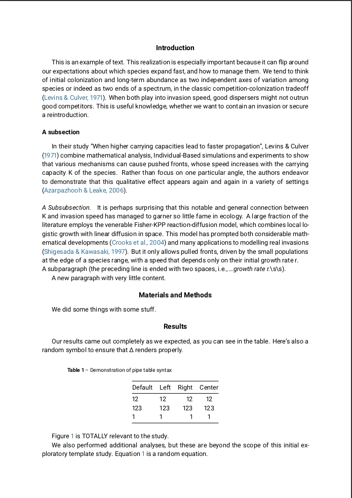

# Peer Community Journal Submission Formatting

This is a Quarto extension that can be used to format a manuscript for submission to the Peer Community Journal (PCJ).

I used the extension for my own publication in PCJ
(GitHub: [bbartholdy/mb11CalculusPilot]([https://github.com/bbartholdy/mb11CalculusPilot](https://github.com/bbartholdy/mb11CalculusPilot/tree/pcj/analysis/paper));
DOI: [10.24072/pcjournal.414](https://doi.org/10.24072/pcjournal.414)),
so I can confirm that the extension sufficiently adheres to the [format requirements](https://peercommunityjournal.org/page/instructions/),
at least in my specific case (your mileage may vary).

To format a preprint for submission to one of the thematic PCIs, I highly recommend the
[Quarto typst extension](https://github.com/alxsimon/typst-pci) created by [Alexis Simon](https://github.com/alxsimon).

## Installing

New repository

```bash
quarto use template bbartholdy/quarto-pdf-pcj
```

Existing repository/project

```bash
quarto add bbartholdy/quarto-pdf-pcj
```

Updating extension

```bash
quarto update bbartholdy/quarto-pdf-pcj
```

## Usage

```bash
quarto render <yourdocument>.qmd --to pci-pdf
```

## Example PDF


